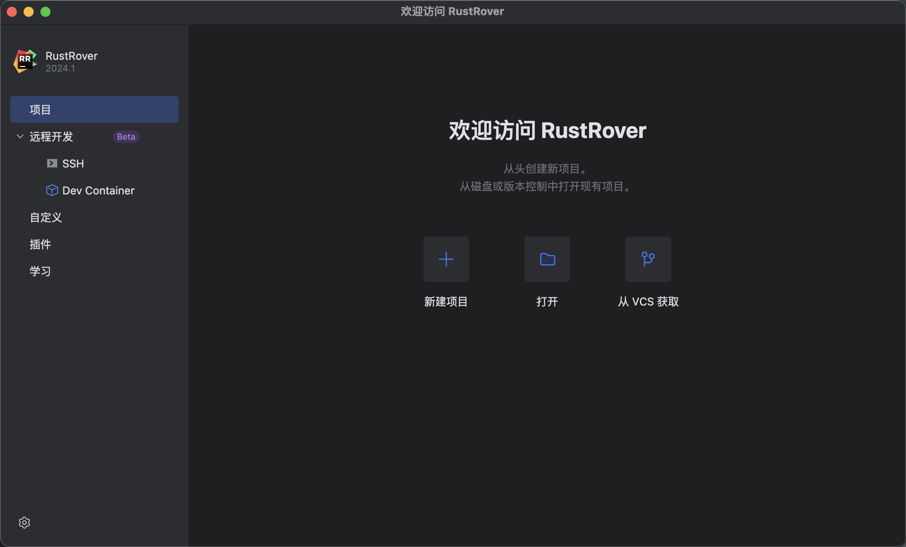
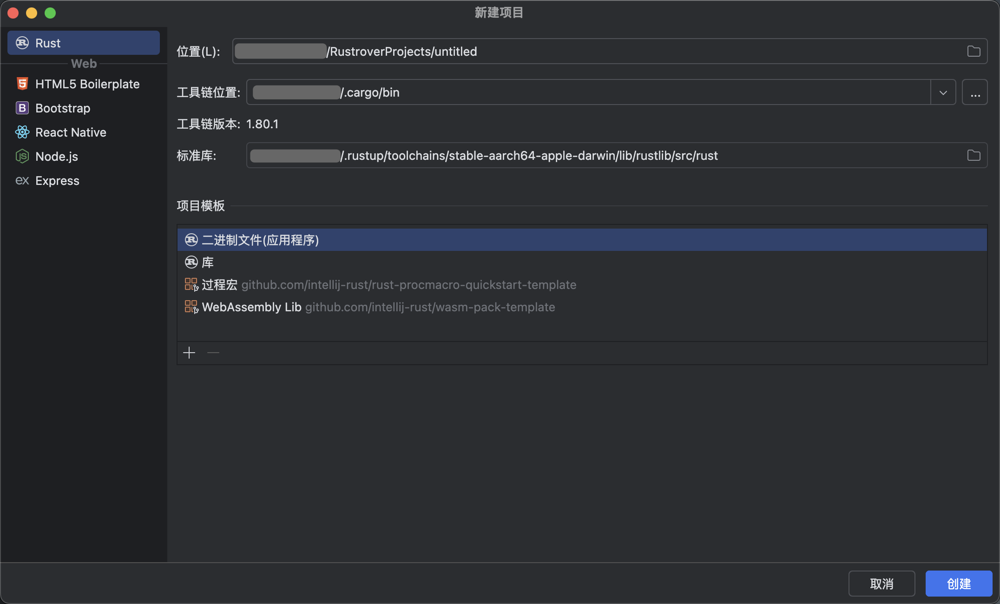
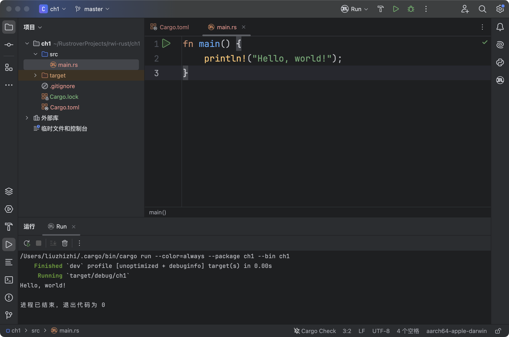

# 入门指南yvRustRover 


RustRover 是 JetBrains 专为 Rust 开发的集成开发环境 (IDE)。它为 Rust 提供了全面的支持，结合了 JetBrains 强大的代码分析和开发工具，让开发者在 Rust 项目中更加高效。以下是 RustRover 的使用方法和一些关键功能的介绍：

### 1. **安装与设置**

   - **下载与安装**:
     - 前往 JetBrains 官方网站或 RustRover 的页面，下载适用于你的操作系统的安装包。
     - 安装过程与其他 JetBrains 产品类似，按照提示完成安装即可。

   - **设置 Rust 工具链**:
     - 安装完成后，打开 RustRover，它会自动检测并设置 Rust 工具链（包括 Rust 编译器、Cargo 等）。
     - 如果你没有安装 Rust 工具链，RustRover 会提示你安装。你可以使用 `rustup` 工具来安装并管理 Rust 版本。

### 2. **创建和管理项目**

   - **创建新项目**:

     - 打开 RustRover，选择 `File > New > Project`，或点击新建项目。

       

     - 填写项目名称和路径，选择项目模板，然后点击 `Create`。

       

     - RustRover 会自动生成一个基本的 Rust 项目结构。

     > 在 RustRover 中，当你创建一个新项目时，可以选择不同的项目模板来快速开始开发。以下是对这些项目模板的介绍：
     >
     > ### 1. **二进制文件(应用程序)**
     >
     >    - **简介**: 这是一个典型的 Rust 项目模板，用于创建可执行的二进制文件。这个模板适用于开发命令行工具、服务器、或者任何其他形式的应用程序。
     >    - **特点**:
     >      - 包含一个 `main.rs` 文件，这是程序的入口点。
     >      - 使用 `Cargo` 管理项目依赖和构建流程。
     >
     > ### 2. **库**
     >
     >    - **简介**: 这个模板用于创建 Rust 库，目的是编写可以被其他项目或应用程序复用的代码。与二进制文件不同，库不会生成可执行文件，而是生成 `.rlib` 文件。
     >    - **特点**:
     >      - 包含一个 `lib.rs` 文件，这是库的入口点。
     >      - 同样使用 `Cargo` 管理依赖，并允许导出库功能供其他项目使用。
     >
     > ### 3. **过程宏**
     >
     >    - **简介**: 这个模板适用于创建过程宏（Procedural Macros），Rust 中的一种用于生成代码的强大工具。过程宏通常用于自定义派生、函数属性和属性宏。
     >
     > ### 4. **WebAssembly Lib**
     >
     >    - **简介**: 这个模板用于创建 Rust 到 WebAssembly (Wasm) 的库，可以被嵌入到网页中运行。WebAssembly 是一种紧凑的字节码格式，可以在浏览器中高效运行。
     >
     > ### **如何选择合适的模板？**
     >
     > - **如果你是初学者**: 从 `二进制文件(应用程序)` 模板开始，因为它最直观地展示了如何编写和运行一个完整的 Rust 程序。
     > - **如果你打算开发可复用的功能模块**: 选择 `库` 模板，以便将你的代码设计为可以被其他项目复用的形式。
     > - **如果你有兴趣学习 Rust 的高级特性**: 尝试使用 `过程宏` 模板，学习如何使用宏来生成和简化代码。
     > - **如果你希望将 Rust 用于 Web 开发**: `WebAssembly Lib` 是理想的选择，特别是当你需要在浏览器中运行高效代码时。

   - **导入现有项目**:

     - 选择 `File > Open`，然后选择现有的 Rust 项目的根目录，RustRover 会自动导入项目并解析依赖。

### 3. **编写代码**

   - **代码补全与建议**:
     - RustRover 提供了智能代码补全功能。当你编写代码时，IDE 会根据上下文提供函数、方法、变量等的建议。
     - RustRover 还会为你自动补全代码片段，如闭包、循环、条件语句等，提高编码效率。

   - **代码导航**:
     - 使用 `Ctrl + Click`（或 `Cmd + Click` 在 macOS 上）可以快速跳转到变量、函数、模块的定义。
     - RustRover 支持项目内的全局搜索，使用 `Shift + Shift` 快速搜索文件、类、符号或任何其他内容。

### 4. **项目构建与运行**

   - **构建项目**:
     - 使用 `Ctrl + Shift + F9`（或 `Cmd + Shift + F9` 在 macOS 上）构建整个项目。
     - RustRover 集成了 Cargo，你也可以在项目视图中右键选择 `Cargo Tasks > build` 来构建项目。

   - **运行和调试**:
     - 在 `src/main.rs` 文件中右键点击，选择 `Run 'main'` 来运行你的 Rust 程序。
     - 你也可以设置断点（点击行号左侧）然后选择 `Debug 'main'` 来调试程序。RustRover 提供了可视化的调试工具，包括变量监视、堆栈跟踪等。

### 5. **依赖管理**

   - **添加依赖**:
     - 打开 `Cargo.toml` 文件，手动添加依赖包名称和版本号。RustRover 会自动解析并下载依赖。
     - 你也可以使用 RustRover 的 Cargo 依赖管理工具，在 `Cargo.toml` 中通过自动补全功能添加依赖。

   - **更新依赖**:
     - 在 `Cargo.toml` 文件中右键选择 `Cargo Tasks > update` 更新项目的所有依赖。
     - RustRover 会自动处理依赖冲突并提供建议。

### 6. **测试与文档生成**

   - **编写和运行测试**:
     - 在 `src` 目录下创建一个 `tests` 模块或文件，编写测试代码。
     - 你可以右键点击测试文件或模块，选择 `Run 'tests'` 运行测试。RustRover 提供了测试结果的可视化界面。

   - **生成文档**:
     - RustRover 集成了 `cargo doc`，你可以通过 `Cargo Tasks > doc` 生成项目文档。
     - 生成的文档将会在默认浏览器中打开，展示项目的 API 文档。

### 7. **版本控制**

   - **Git 集成**:
     - RustRover 提供了完整的 Git 支持。你可以直接在 IDE 中进行提交、推送、合并等操作。
     - 使用 `VCS` 菜单，可以查看项目的版本历史、分支管理以及代码冲突解决。

### 8. **高级功能**

   - **代码重构**:
     - RustRover 提供了强大的重构功能，你可以安全地重命名变量、函数、模块，甚至可以自动提取方法。
     - 选中代码片段，右键选择 `Refactor`，选择所需的重构操作。

   - **代码分析与检查**:
     - RustRover 会在你编写代码时自动进行代码检查，并提示潜在的错误和改进建议。
     - 你可以在 `Code` 菜单下选择 `Inspect Code`，查看整个项目的代码检查报告。

RustRover 作为 Rust 的专用 IDE，为开发者提供了强大的工具和功能，极大地提升了 Rust 开发的效率。通过这些基本操作，你可以迅速上手 RustRover 并将其应用于日常的开发工作中。

# Hello, World!

一个新建的 Rust 项目在 RustRover 中的界面：



### 1. **`main.rs` 文件**

   - **内容**: RustRover 已经为你生成了一个 `main.rs` 文件，并且在其中包含了 `Hello, World!` 的代码：

     ```rust
     fn main() {
         println!("Hello, world!");
     }
     ```

   - **作用**: 这个文件是 Rust 项目中最基础的入口点，它定义了程序的主函数 `main()`。在这个例子中，`println!` 宏用于在控制台输出 "Hello, world!" 字符串。

### 2. **如何运行项目**

   - **运行按钮**: 在页面的右上角，你可以看到一个绿色的 "Run" 按钮（带有三角形图标的按钮）。点击这个按钮可以运行当前的项目。
   - **输出**: 运行项目后，RustRover 会在底部的终端窗口显示 "Hello, world!"，表示程序成功执行。

### 3. **界面中其他部分的介绍**

   - **项目结构**（左侧面板）:
     - **`src` 文件夹**: 这个文件夹包含了项目的源代码，默认情况下只包含一个 `main.rs` 文件。
     - **`target` 文件夹**: 这个文件夹是 Rust 编译器生成的输出目录，包含了编译后的二进制文件。这个目录通常是自动生成的，你一般不需要手动操作。
     - **`Cargo.toml`**: 这是 Rust 项目的配置文件，包含了项目的元数据（如项目名称、版本、依赖等）。它是 Rust 项目管理的重要文件。
     - **`Cargo.lock`**: 这个文件由 Cargo 自动生成，用于记录项目的依赖关系及其精确的版本号，确保项目的依赖环境一致。

   - **顶部文件标签**:
     - **`Cargo.toml`** 和 **`main.rs`** 标签: 顶部显示了当前打开的文件。你可以通过点击不同的标签来快速切换文件。

   - **左侧工具栏**:
     - **项目面板**: 显示当前项目的文件和文件夹结构。
     - **版本控制**: 如果你使用 Git 等版本控制工具，点击此按钮可以管理分支、提交、更改记录等。
     - **调试工具**: 这里可以设置断点，进行项目的调试工作。
     - **终端**: 提供一个集成的终端窗口，可以直接在 IDE 内运行命令。

   - **状态栏**（底部）:
     - **Cargo 状态**: 在状态栏的底部，显示了 `Cargo Check` 的状态，表示 Cargo 检查你的代码是否有语法错误或其他问题。
     - **文件信息**: 显示当前文件的编码格式（如 UTF-8）、行号、文件大小等信息。
     - **编译目标**: 显示当前编译目标平台（在这个例子中是 `aarch64-apple-darwin`，即在 Apple M1 或 M2 芯片上的 macOS）。

